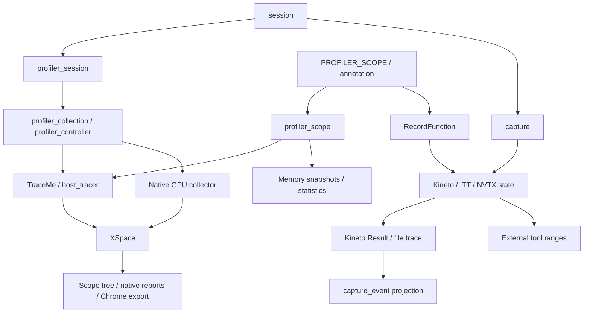
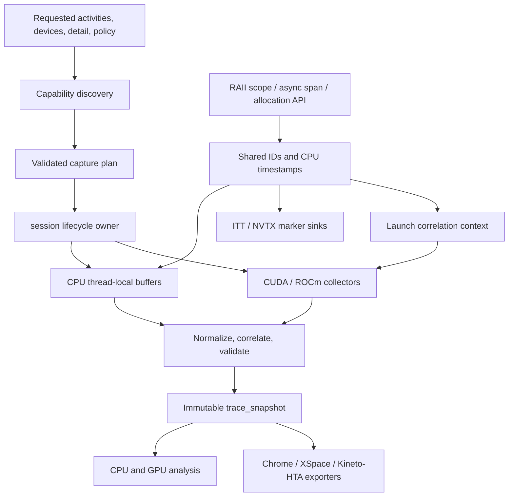

# Profiler design review and efficient, reliable CPU/GPU plan

Review date: 2026-09-15. Source revision: `a974a18`.

Plan updated to prioritize very low overhead and dependable profiling of
application CPU and GPU code. The supported target is native CPU profiling plus
NVIDIA CUDA/CUPTI and AMD HIP/ROCm device collection. **Drop Metal support** as
the first implementation phase; retain macOS CPU profiling.

This document specifies planned changes. The source findings and validation
results describe the reviewed revision; editing this plan does not remove the
existing Metal implementation. Collector selection follows requested activities
and verified runtime capabilities. Analysis runs after collection on the CPU;
GPU-based aggregation is outside the current scope.

### Contents

- [Recommendation](#1-recommendation)
- [Efficiency and reliability requirements](#11-efficiency-and-reliability-requirements)
- [Metal removal scope](#12-metal-removal-scope)
- [Current architecture](#2-current-architecture)
- [Prioritized findings](#3-findings-ordered-by-priority)
- [Class and struct inventory](#4-classes-and-structs-what-to-keep-simplify-or-retire)
- [Backend pros and cons](#5-backend-capabilities-pros-and-cons)
- [Target design](#6-target-design)
- [Implementation phases](#7-implementation-plan-and-completion-criteria)
- [Conformance tests](#8-test-strategy-for-minimum-discrepancy)
- [Validation performed](#9-validation-performed-for-this-review)

## 1. Recommendation

Keep `profiler::session` as the application entry point. Give it one lifecycle,
one validated configuration, and one immutable capture result. Make CPU tracing,
GPU activity collection, external-tool annotations, and export separate roles.
Backend adapters should implement those roles without defining the public data
model or changing what a duration means.

The existing building blocks are useful: RAII annotations, thread-local native
recording, the collector interface, XSpace utilities, Kineto integration, and
post-capture hierarchy reconstruction. The principal weakness is that these
pieces have been wrapped together without fully unifying their contracts.

Minimum discrepancy should mean **the same meaning, identity, error behavior,
and availability reporting**, with measured timing uncertainty. It cannot mean
identical durations on different devices or equal detail from an annotation API
and a device activity collector.

### 1.1 Efficiency and reliability requirements

Correct capture semantics, application stability, and low measurement overhead
are release requirements. Additional backends and optional analysis features
must not weaken them. Performance is measured at the public API and application
workload, including adapter costs, rather than inferred from recorder internals.

| Area | Mandatory design requirement | Evidence required before release |
| --- | --- | --- |
| Inactive scopes | Zero profiler-owned allocations, locks, clock reads, or backend calls; cheap enabled-state check; lazy labels evaluated only when recording | Allocation/interception tests after warmup and public-macro benchmarks |
| Compile-time disabled instrumentation | Scope instrumentation compiles out and does not evaluate label expressions; semantics documented | External-consumer compile/behavior checks |
| Active CPU scopes | One authoritative CPU record; no per-event heap allocation or process-wide mutex on the registered, warmed-up static-label path | Allocation/lock checks, many-thread throughput and p50/p95/p99 scope latency |
| GPU collection | Buffered asynchronous activities; no per-scope device synchronization; explicit device/stream binding for optional event timing | Real multi-stream workloads and instrumentation of synchronization calls |
| Memory use | Configured limits cover event buffers, metadata, strings, correlation maps, and profiler-owned queues; SDK buffer limits configured where supported | Sustained-load, unique-label, overflow, and peak-memory tests; report unbounded SDK behavior explicitly |
| Record loss | Every known loss or collection failure is surfaced; unavailable loss accounting is labeled unknown | Exact synthetic accounting, forced overflow/OOM and SDK error injection |
| Session integrity | Defined transitions, rollback, per-thread callback ownership, generation isolation, and retained result lifetimes | State-machine tests, restart stress, sanitizer runs and delayed callbacks |
| Timing integrity | Shared CPU clock, explicit device calibration/uncertainty, preserved units, valid correlation and measurement kind | Synthetic clock tests and real-device reference measurements |
| Export integrity | Repeatable export; success only after the requested output is fully written and closed; no format switch on I/O error | Repeated export, unwritable path, injected write/close failure and schema checks |
| Optional detail | Stacks, memory tracking, expensive metadata, counters and external marker sinks disabled in the default timeline preset | Per-feature overhead measurements and explicit effective configuration |

**Initial workload-overhead targets:** at most 1% with capture inactive, 3% for
the default CPU timeline on representative workloads with scope durations of at
least 10 microseconds, and 5% for the default CPU/GPU timeline on the designated
compute/transfer workloads. These are proposed engineering targets, not measured
results or guarantees for every program. Phase 0 fixes the reference machines,
workloads, event rates, noise bounds, and per-platform budgets before optimization.
Report each workload, repeated-run distributions, tail latency and event loss;
a fast run that lost events does not pass. Tiny scopes/kernels and optional detail
receive separate overhead curves and published operating limits. Investigate
target failures and revise scope or explicitly justify a budget change; do not
silently weaken a gate or hide a regression in an average.

Reliability means errors cannot masquerade as complete measurements. Captures
carry `complete`, `partial`, or `failed` status, per-source diagnostics and
coverage. An unavailable required GPU collector fails startup by default;
best-effort collection requires explicit opt-in. Buffer exhaustion yields a
partial capture with loss diagnostics while application execution continues.
Only captures meeting declared coverage and integrity requirements qualify for
complete status. Unknown coverage is not represented as zero GPU work.

### 1.2 Metal removal scope

Remove Metal support in the first implementation phase, including:

- `PROFILER_GPU_BACKEND=metal`, `PROFILER_HAS_METAL`, Metal/Foundation linkage,
  and Objective-C++ enablement that exists solely for this backend. Accepted GPU
  build choices become `none`, `cuda`, and `hip`; reject `metal` explicitly.
- Public `activity::metal`, internal Metal activity aliases/mappings and names,
  and Metal-specific capability/reporting branches. Version the API change;
  preserve numeric identities of retained values and reject obsolete raw values.
- `Profiler/bespoke/base/metal.mm`,
  `Profiler/native/gpu/metal_gpu_probe.mm`, and the Metal-only probe API/guards.
- `Testing/Cxx/TestProfilerBackendMetal.cpp`, its CMake registration, and the
  Metal execution branch in `TestProfilerGpuTracer.cpp`. Retain the generic
  synthetic GPU collector tests and replace probe coverage with CUDA/HIP hardware
  workloads. Review generic PrivateUse1 support separately: remove Metal routing
  without deleting compatibility code still needed by the Kineto adapter.
- Advertised Metal support in build help, README/user guides, examples, sample
  descriptions and future CI plans. Historical review findings may remain as
  evidence, clearly marked as retired from the target design.

**Removal acceptance:** no supported configuration, public activity, linked
framework, source target, or runtime registration enables Metal; obsolete Metal
requests fail clearly. CPU-only macOS builds and tests continue to pass. Metal
is excluded from the new event model, backend roadmap, and GPU hardware matrix.

## 2. Current architecture

Key consequences:

- `session::events()` exposes only instrumentation results.
- Reports and hotspots use only the native session. The scope tree selects the
  host-thread plane, so native GPU planes do not become GPU hotspot reports.
- `write_trace()` prefers Kineto; `write_chrome_trace()` uses native XSpace.
  The two methods can expose different events from the same session.
- `session_options::activities` configures instrumentation, while `gpu_tracing`
  independently enables the native GPU collector.
- `automatic` chooses the compiled instrumentation backend. It does not probe
  hardware, drivers, usable activities, or timing quality.

Evidence: [session implementation](../Profiler/common/session.cpp),
[annotation implementation](../Profiler/common/annotation.cpp),
[scope-tree reconstruction](../Profiler/native/session/scope_tree_builder.cpp).

## 3. Findings, ordered by priority

“Reproduced” means a small standalone program was compiled against the local
Kineto Release library. “Source-confirmed” identifies a directly visible code
path. Concurrency risks below need dedicated sanitizer/stress validation.

### P1 — Correctness and result integrity

1. **A second trace export can report success without creating the file.**
   Reproduced: two `write_trace()` calls to different new paths returned `true`;
   only the first file existed. `ActivityTraceWrapper::save()` silently returns
   after its first save, while `ProfilerResult::save()` returns whether a trace
   object exists. This also prevents the native fallback from running.
   Make export repeatable or return an explicit one-shot-export error; successful
   export must mean the requested output was written.
   [Wrapper, line 186](../Profiler/bespoke/kineto/kineto_shim.cpp#L186);
   [result, line 921](../Profiler/bespoke/kineto/profiler_kineto.cpp#L921).

2. **Backend availability can be falsely reported.**
   Reproduced on a CPU-only build: `nvtx_enabled() == false`, but an explicitly
   requested NVTX capture returned `true` from `start()`. `backend_available()`
   accepts NVTX unconditionally and the default stub does nothing. CUDA/HIP stub
   `enabled()` also reflects compilation rather than a usable device, and
   `cudaCheck()` constructs an error message without propagating it.
   Validate build support, runtime availability, and requested features
   separately. An explicitly required missing collector must fail.
   [Capture resolution, line 61](../Profiler/common/capture.cpp#L61),
   [default stubs](../Profiler/bespoke/base/base.cpp),
   [CUDA/HIP error handling](../Profiler/bespoke/base/cuda.cpp).

3. **The public event struct loses information needed for CPU/GPU analysis.**
   `capture_event` retains name, start, duration, string metadata, and stack.
   Its conversion drops typed thread/device/resource IDs, activity kind,
   correlation IDs, async state, byte counts, and fallback device elapsed time
   available through `KinetoEvent`. It has no native events at all. Consequently,
   its typed API cannot reliably distinguish a CPU range from a GPU kernel or
   connect launches to execution.
   [Public event, line 71](../Profiler/common/capture.h#L71),
   [conversion, line 224](../Profiler/common/capture.cpp#L224),
   [KinetoEvent](../Profiler/bespoke/kineto/profiler_kineto.h#L41).

4. **Session reuse exposes stale results.**
   Reproduced: after stopping run 1 and starting run 2, `events()` still returned
   run 1's event. `start()` does not clear `inst_result_`. Old export state can
   also survive a failed restart. Establish explicit run IDs and clear the
   session's current-result slot at a documented transition; independently held
   completed snapshots should remain valid.
   [Session start, line 104](../Profiler/common/session.cpp#L104).

5. **Lifecycle success and ownership are underspecified.**
   Native `stop()` logs stop/collection failures and returns `true` anyway.
   The facade cannot report which collector failed. Exceptions during
   instrumentation startup can leave native collection running although the
   facade has not set `active_`. The native controller does provide destructor
   cleanup for successfully started collectors, but the facade still needs
   transactional startup and explicit rollback. Report objects borrow the native
   session; hotspot trees borrow its cached tree. Destroying/restarting the
   session can invalidate a report returned in a `unique_ptr`.
   [Native stop, line 253](../Profiler/native/session/profiler.cpp#L253),
   [controller](../Profiler/native/core/profiler_controller.cpp),
   [report ownership](../Profiler/native/session/profiler_report.h),
   [hotspot ownership](../Profiler/native/analysis/hotspot_report.h).

6. **Memory accessors can dereference absent components.**
   `session::get_memory_tracker()` dereferences `native_`; the native accessor
   dereferences `memory_tracker_`. The facade defaults `memory_tracking` to
   `false`, so even a started default session has no tracker. Before `start()`
   or with `native=false`, the first dereference is also invalid. Return an
   optional/reference result with a clear error, or expose a safe reporting
   handle independent of whether capture is enabled.
   [Facade, line 210](../Profiler/common/session.cpp#L210),
   [native accessor](../Profiler/native/session/profiler.h).

7. **Atomic pointers do not protect collector or scope lifetimes.**
   A producer can load the native GPU collector pointer, then race with
   `disable()`, collection, and destruction. The raw pointer has no lifetime
   lease or callback-drain guarantee. `profiler_scope` similarly stores a raw
   session pointer; the current user guide requires scopes to finish before
   session stop/destruction, so using a scope beyond that lifetime violates the
   existing contract. A future asynchronous API needs stronger ownership rather
   than inheriting that restriction implicitly. Separately, worker enrollment shares one
   `KinetoThreadLocalState`, whose `handle_` is overwritten by each thread's
   callback registration; simultaneous workers can race on that field. ITT and
   NVTX return before the shared worker-enrollment state is published, so the
   same child-thread helper does not enroll their workers.
   Use a retained run context, per-thread registration ownership, and an
   explicit producer-quiescence step. These are source-level concurrency risks,
   not reproduced sanitizer failures in this review.
   [GPU producer, line 210](../Profiler/native/gpu/gpu_event_collector.cpp#L210),
   [worker enrollment, line 641](../Profiler/bespoke/kineto/profiler_kineto.cpp#L641),
   [shared callback handle](../Profiler/bespoke/common/orchestration/observer.cpp#L148).

8. **Scope reconstruction can produce a false parent.**
   Reproduced with `A=[1000,3000]` and `B=[2000,4000]`: B became A's child even
   though A does not contain B. Reconstruction checks whether a parent ended
   before the child's start but never checks the child's end. Equal-start
   events are sorted only by start time. Incorrect parenting then affects self
   time. Prefer explicit parent IDs; for imported events, check full containment
   and define overlap/tie handling. GPU overlap must remain a graph of launches
   and dependencies, not be forced into this CPU nesting algorithm.
   [Nesting, line 104](../Profiler/native/session/scope_tree_builder.cpp#L104).

### P2 — Consistency, overhead, and maintainability

9. **Native GPU collection is infrastructure, not automatic device tracing.**
   `create_gpu_tracer()` enables an event collector, not CUPTI/ROCm interception.
   The built-in real-device producer is `run_gpu_kernel_probe()` on Metal; it
   creates and waits for its own command buffer. Ordinary application Metal
   command buffers are not automatically observed. The bespoke Metal fallback
   uses a CPU clock and is reachable through an internal PrivateUse1 state, not
   the public `capture_backend` enum. Requesting `activity::metal` alone does not
   wire up that fallback or the native probe.
   **Updated decision:** remove both Metal paths in Phase 0. Retain generic GPU
   buffering and validate CUDA/HIP producers against the same event contract.
   [Native GPU implementation](../Profiler/native/gpu/gpu_tracer.cpp),
   [Metal probe](../Profiler/native/gpu/metal_gpu_probe.mm),
   [Metal fallback](../Profiler/bespoke/base/metal.mm).

10. **Timing semantics and precision vary.**
    Native TraceMe uses `steady_clock`; native scope statistics also take
    independent `high_resolution_clock` samples; the bespoke clock takes
    different paths on Linux and macOS/Windows. `get_duration_ms()` first
    truncates to integer microseconds, losing sub-microsecond data. CUDA/HIP
    fallback records events on `nullptr` stream, which does not identify an
    application's arbitrary stream; the “per-thread default stream” comment is
    not a portable guarantee. Its elapsed calculation synchronizes GPU events.
    Introduce clock domains, explicit stream bindings, and measurement kinds;
    preserve integer nanoseconds until presentation.
    [Native duration conversion](../Profiler/native/session/profiler.cpp#L153),
    [clock implementation](../Profiler/common/approximate_clock.h),
    [GPU event fallback](../Profiler/bespoke/base/cuda.cpp).

11. **The public inactive path still allocates.**
    Reproduced after warmup: 1,000 short-name `PROFILER_SCOPE("idle")` calls with
    no session caused 2,000 `operator new` calls on the local Kineto Release
    build. `annotation::impl` and `profiler_scope_data` are allocated before the
    active-session check. Active native scopes additionally compute per-scope
    statistics, use shared analyzer locks, and maintain a data object whose tree
    is later reconstructed again. The internal recorder's performance comments
    do not establish the overhead of the public macros.
    [Annotation allocation](../Profiler/common/annotation.cpp#L35),
    [scope allocation/work](../Profiler/native/session/profiler.cpp#L464).

12. **Metadata and memory semantics are fragmented.**
    `with_stack` records a source-location string in the ordinary Kineto macro
    path, not a full native unwind. ITT ignores stack/memory/FLOP/module requests.
    `inputSizes()` returns an empty vector; `with_flops` and `with_modules` have
    no corresponding collection logic in the reviewed path. Native memory
    samples take the absolute value of the change in process-wide tracked live
    bytes and aggregate by name, losing the sign and per-invocation identity.
    A parallel allocation can therefore affect another scope's snapshot delta.
    Use allocation events with explicit device, allocator, size, and attribution;
    distinguish source location, call stack, supplied shape, and estimated FLOPs.
    [Collection](../Profiler/bespoke/common/collection.cpp#L69),
    [shape stub](../Profiler/bespoke/common/util.cpp#L150),
    [ITT observer](../Profiler/bespoke/itt/itt_observer.cpp),
    [memory sampling](../Profiler/native/session/profiler.cpp#L598).

13. **Public/private boundaries and build contracts are porous.**
    `profiler.h` includes native session/report headers, and installation copies
    all headers, despite the documented internal status of those APIs. Static
    factory registration can also be discarded when an archive consumer has no
    reference to its translation unit; this is a build risk, not tested here.
    `PROFILER_GPU_BACKEND` has a UI list but no value validation like
    `PROFILER_BACKEND`. CUDA fallback policy also conflicts with the checked-out
    Kineto CMake's required CUDA/CUPTI detection. Make supported configurations,
    dependencies, registration, and package exports explicit.
    [Umbrella header](../Profiler/profiler.h),
    [build options](../cmake/ProfilerOptions.cmake),
    [build/install](../CMakeLists.txt),
    [Kineto prerequisites](../third_party/kineto/libkineto/CMakeLists.txt).

## 4. Classes and structs: what to keep, simplify, or retire

In C++, `struct` and `class` differ in default member/base access. Changing the
keyword does not itself reduce memory use or CPU overhead. Use structs for
configuration and event values; use classes for ownership, lifecycle, resource
management, or invariants. Getter/setter wrappers without validation do not
create a stronger design.

The inventory below covers the profiler domain and its main data path. “Unused”
means no in-repository use found by reference/include searches; installed APIs
may have external consumers, so deprecate public surfaces before removal. This
is not a claim that every vendored utility or template was proven dead.

| Type / group | Current usage | Decision |
| --- | --- | --- |
| `session` | Main facade; delegates to two sessions | Keep the class; give it a private implementation and one lifecycle owner |
| `capture`, `capture_result` | Active instrumentation API | Keep compatibility wrappers; converge their results with `session` |
| `annotation` | All public scope macros | Keep RAII; use compact inline state and a cheap inactive gate |
| `child_thread_capture` | Used, but backend-dependent enrollment | Replace internals with a per-thread, run-bound RAII registration |
| `session_options`, `capture_config` | Used; largely duplicated | One public request struct; adapters receive a validated effective plan |
| `profiler_options` | Used by native API/builder | Deprecate the competing public configuration surface; preserve compatibility mapping |
| `profile_options` | Used by native factory/collectors | Reduce to internal collector configuration; getters alone do not warrant another public abstraction |
| `ProfilerConfig`, `ExperimentalConfig` | Used by bespoke/Kineto internals | Keep backend-specific settings private; map supported public features explicitly |
| `profiler_session` | Native lifecycle, analysis, collection, export | Split responsibilities; eventually private behind `session` |
| `profiler_session_builder` | Used configuration convenience | Compatibility only, or build the same public request; no separate semantics |
| `profiler_interface` | Used by native collectors | Evolve into the activity-collector interface with capabilities and structured status |
| `profiler_controller`, `profiler_collection`, `ProfilerLock` | Used lifecycle enforcement and exclusivity | Keep useful ownership/rollback behavior; enforce it for every public entry path |
| `traceme_recorder::Event`, `ThreadInfo`, `ThreadEvents` | Active native record/batch types | Keep compact internal records; add explicit identity/generation where needed |
| `RecordFunction`, `ThreadLocalSubqueue`, `RecordQueue` | Active instrumentation path | Reuse backend integration; share frontend identity and authoritative CPU timestamps |
| `capture_event` | Used public projection | Replace/evolve into a typed, complete event view; retain an explicit legacy projection |
| `gpu_tracer_event` | Used by synthetic input and the Metal probe scheduled for removal | Retain generic records for CUDA/HIP; add device/queue identity, clock and quality; preserve annotation or stop collecting it unused |
| `KinetoEvent`, `Result`, `ExtraFields`, `FallbackPair`, `ProfilerStepInfo` | Used adapter/result machinery | Keep inside the adapter; normalize once into the common result |
| `profiler_scope_data` | Used both on the hot path and as reconstructed tree nodes | Split compact live scope state from a cold report/tree view |
| `memory_stats`, `memory_allocation` | Used in native memory tracking | Keep value types; define process/device/allocator scope and signed changes |
| `timing_stats`, `statistical_metrics`, `time_series_point` | Used, overlapping timing representations | Keep one accumulator plus result views; use a common time unit |
| `stat`, `stat_with_percentiles`, `stats_calculator`, `stat_summarizer_options` | Used in analysis/reports | Reuse or consolidate behind one analysis layer; these are not dead structs |
| `profiler_report`, `hotspot_report` | Active, with borrowed lifetime | Make them own/share an immutable capture snapshot |
| `profiler_report_builder` | Used; two switches are not forwarded by `build()` | Implement or deprecate the ignored switches |
| `x_space`, `xplane`, `xline`, `xevent`, metadata/stat types | Core native storage and export | Keep during migration; enforce canonical semantics through typed access and validation |
| `device_option`, `device_enum` | Used by memory/bespoke events | Converge CPU/CUDA/HIP identity; remove Metal aliases and keep required vendor compatibility internal |
| `remote_profiler_session_manager_options` | Declaration only in this repository | Remove from the supported API after deprecation, or implement remote capture separately |
| `native/utils/timespan.h` | No in-repository includes found; duplicates the core type in another namespace | Deprecate/remove or forward to the used `native/core/timespan.h` implementation |
| Native `python_tracer` / `python_tracer_stub` | Real implementation disabled; registered stub succeeds without data | Report unsupported; do not advertise a working Python collector |
| `MetadataCollector` | Registered, disabled in the facade, emits no data even if selected | Remove the placeholder from supported capabilities |

Specific inert or misleading fields:

- `enable_thread_safety_`: configured, never read to change behavior. Prefer a
  fixed concurrency contract over a switch that suggests unsafe mode is valid.
- `thread_pool_size_`: copied to `worker_threads_hint_`, which is stored but not
  used to create workers or schedule analysis.
- `profiler_report_builder::include_statistical_analysis_` and
  `include_memory_details_`: stored, not applied in `build()`.
- `profile_options::include_dataset_ops`, `repository_path`, and `duration_ms`:
  no functioning dataset/output/scheduling consumer in the reviewed native path.
  `enable_hlo_proto` selects an empty collector.
- `gpu_tracer_event::annotation`: populated but not written by `export_xspace()`.
- `enable_timing_=false`: hierarchy can still activate timestamped TraceMe
  collection, so its actual meaning is not “no timing work.”

Sources: [native options](../Profiler/native/core/profiler_options.h),
[native session](../Profiler/native/session/profiler.cpp),
[report builder](../Profiler/native/session/profiler_report.cpp#L1032),
[analyzer](../Profiler/native/analysis/statistical_analyzer.cpp),
[GPU export](../Profiler/native/gpu/gpu_event_collector.cpp).

## 5. Backend capabilities, pros, and cons

These are distinct roles, not interchangeable alternatives in a single enum.
“Available upstream” does not mean that this repository exposes the capability.
The table describes the checked-out implementation and the retained target
backends. Metal paths are retired under section 1.2 and are not alternatives
for the new design.

| Backend / path | What it currently provides | Pros | Cons / limits | Recommended role |
| --- | --- | --- | --- | --- |
| Native CPU | Annotated CPU elapsed intervals, native memory tracking, XSpace, reports | Portable baseline; library controls event semantics; existing hierarchy/export tools | Public macro allocates when inactive; active statistics add locks; no automatic function discovery; scope time includes waiting | Authoritative CPU scope collector for every build |
| Kineto CPU | RecordFunction events, source locations, allocator events, Kineto JSON | Rich trace structure; existing HTA workflow; CPU-to-device correlation integration | Duplicates native recording; larger dependency surface; public projection drops fields; save is currently one-shot | Adapter for device integration and explicit Kineto/HTA export |
| Kineto + CUDA/CUPTI | Runtime/device activity path when built and usable | Kernel/copy/memset activity; stream/context/correlation information; asynchronous collection | NVIDIA-specific; runtime/toolkit constraints; buffering overhead and loss must be reported; actual GPU path not validated locally | Preferred NVIDIA device activity collector |
| Kineto + HIP/ROCm | ROCm activity path selected by `KINETO_BACKEND=rocm` | AMD device activity and correlation through an existing adapter | ROCm prerequisites; no HIP CI entry here; CUDA-oriented legacy names obscure semantics; build path needs hardware validation | Preferred AMD collector after build/runtime conformance validation |
| CUDA/HIP event fallback | Pairs of runtime events around host annotations | Can measure a bound stream interval without full activity tracing | Current code binds `nullptr` stream; no per-kernel breakdown; elapsed queries synchronize; current public event loses the measured fallback time | Optional explicit `stream_interval` mode after core activity capture passes its gates; never an automatic fallback |
| ITT | Task ranges sent to ITT | Integrates application tasks with Intel analysis tools; a focused annotation interface | This implementation does not return a captured file/event stream; requested metadata is mostly ignored; child enrollment differs | Optional marker sink alongside canonical CPU collection |
| NVTX | Push/pop ranges through CUDA stubs when available | Useful Nsight context and range filtering; lightweight annotation API | It does not collect device timing by itself; current availability check is wrong; no native result from the sink; unnecessarily coupled to CUDA runtime setup here | Optional marker sink, independently selectable |

Evidence and upstream boundaries:

- CUPTI supplies asynchronous activity records and correlation between API calls
  and their device work. Preserve device/context/stream identities and handle
  records arriving after the host call returns.
  [NVIDIA CUPTI usage](https://docs.nvidia.com/cupti/main/main.html#correlation-id-mechanism).
- The checked-out Kineto CMake uses **ROCprofiler-SDK and requires ROCm 7.0+**;
  older comments referring to ROCTracer do not describe that dependency path.
  AMD documents ROCTracer as deprecated. A new direct AMD adapter should target
  the supported SDK if the existing Kineto adapter proves insufficient.
  [Checked-out Kineto build](../third_party/kineto/libkineto/CMakeLists.txt#L160),
  [AMD migration notice](https://rocm.docs.amd.com/projects/rocprofiler/en/latest/).
- ITT is an instrumentation interface used with analysis tools; capabilities of
  VTune or GPA must not be attributed automatically to this library's ITT adapter.
  [Intel ITT documentation](https://intel.github.io/ittapi/index.html).
- NVTX calls normally do nothing without an attached developer tool. Modern
  NVTX is available independently of GPU collection, so marker availability
  should not require a usable CUDA device.
  [NVIDIA NVTX documentation](https://nvidia.github.io/NVTX/).

### Deployment choices

- **CPU application:** native CPU collection; add Kineto/HTA, ITT, or NVTX only
  for required integration or output.
- **NVIDIA application:** native CPU + Kineto/CUPTI; optionally NVTX. Use stream
  timing only when explicitly requested and supported; no automatic downgrade.
- **AMD application:** native CPU + validated Kineto/ROCprofiler-SDK. Keep HIP
  stream timing as a separate capability tier.
- **macOS application:** native CPU collection. Metal GPU profiling is removed.
- **Multi-vendor process:** future capability, not currently supported by the
  single `PROFILER_GPU_BACKEND` choice or the vendored Kineto's mutually exclusive
  GPU build. Separate adapters/tooling may be required; do not promise that
  changing the public enum alone enables mixed-vendor capture.

## 6. Target design

### 6.1 Separate requests, discovered capabilities, and effective configuration

Use value structs for:

- `session_options`: requested CPU/GPU activities, optional device selectors,
  collection detail, marker sinks, memory/source-location options, buffer budget,
  and required-versus-best-effort policy.
- `backend_capabilities`: compiled support, runtime/device availability,
  supported activity kinds, timestamp source/resolution, correlation support,
  scope/stream/kernel granularity, and unavailable reasons.
- `capture_plan`: selected collectors and devices, enabled features, conflicts,
  allowed fallbacks, and diagnostic messages. Produce this once before capture.

Selection is deterministic: filter by available support, satisfy all required
features, apply explicit preference if present, and stay within the requested
detail and overhead preset. Native CPU remains the baseline when requested.
Require the requested GPU collector by default. Best-effort capture is explicit
and reports unavailable features. Stream timing is a separately requested mode;
a GPU activity request cannot become stream or CPU dispatch timing automatically.

Internal CPU API tracing needed for device correlation can remain enabled even
when the user requests device-only output. Keep that distinction explicit in
the effective plan. Device discovery should avoid creating contexts or
synchronizing application work unnecessarily.

### 6.2 Keep a small set of ownership classes

| Class / interface | Sole responsibility |
| --- | --- |
| `session` | Validate requests, own the run, enforce transitions, publish the result |
| `run_context` | Retained generation/state used by scope and callback producers |
| `activity_collector` | Probe/prepare/start/quiesce/collect one source; return structured status |
| `marker_sink` | Emit annotations to an external tool; no claim of owning a trace |
| `trace_snapshot` | Own completed immutable events, metadata, diagnostics, and capabilities |
| Analysis/report objects | Compute views from a retained snapshot |
| Exporters | Serialize that snapshot under an explicit format contract |

Keep virtual dispatch at collector lifecycle/batch boundaries. Do not add one
heap-allocated polymorphic object per event. A private implementation is useful
for the cold `session` object; putting an allocating Pimpl behind every scope is
the opposite tradeoff for the hot path.

C++20 is the project's baseline: use a project result/status type, not an
unconditional dependency on C++23 `std::expected`. Preserve existing bool APIs
as compatibility wrappers with retrievable detailed diagnostics.

### 6.3 Define one event contract

The conceptual record below specifies required information; it is not a
ready-to-compile public API or a requirement to put every optional field inline.
Use compact headers, interned strings, and typed side payloads in storage.

| Field group | Required meaning |
| --- | --- |
| Identity | Capture generation + event ID; parent scope ID; separately typed launch/dependency links |
| Kind | CPU scope, runtime API, GPU kernel, transfer, fill, stream interval, allocation, counter, marker |
| Execution location | Process/thread; device vendor/API and ordinal; context; queue/stream; explicit absent values |
| Time | Integer start/duration in canonical session-relative nanoseconds; original clock domain and calibration reference |
| Measurement | Device activity, explicitly requested device-event interval, or CPU elapsed; granularity and uncertainty |
| Data | Interned name/source location; typed metadata; transfer bytes/direction; allocator and signed allocation size as applicable |
| Integrity | Complete/incomplete, estimated, invalid timestamp, missing correlation, dropped-record diagnostics |

Use 64-bit identities and namespace backend IDs by run/source/context. Do not
truncate native annotation IDs to 32 bits as the current GPU bridge does. Retain
vendor-specific metadata in namespaced extensions instead of discarding it to
force all backends into the lowest common detail.

**Storage migration:** initially wrap the existing XSpace in a typed immutable
snapshot and import normalized Kineto records directly through C++ APIs. Add
validation and fields needed by the contract. Do not serialize Kineto JSON and
parse it back for ordinary collection. Keep legacy backend blobs only for
explicit compatibility export, not as a competing source for common reports.
Evaluate replacing XSpace storage with packed event arrays only after measuring
memory and conversion cost. This avoids introducing a fourth canonical store
before the existing two are reconciled.

The adapter must reuse the authoritative CPU scope record or batch view rather
than retaining a second full CPU trace in the default preset. Snapshot publication
transfers ownership of immutable batches where possible; reports use views and
lazy indexes. Budget temporary conversion memory and release adapter buffers
once transferred. Compatibility exports must not force every capture to retain
multiple complete representations.

### 6.4 Enforce timing, attribution, and analysis semantics

1. Capture a CPU scope's ID and timestamps once. During migration, pass that
   identity through native and Kineto recording and select one authoritative
   CPU record. Never deduplicate by name/time heuristics.
2. Capture launch correlation on the submitting thread, then retain it until
   asynchronous device records arrive. Reading TLS from a completion callback
   cannot reconstruct the original launch context.
3. Use one monotonic CPU domain. Record explicit calibration for each distinct
   device/raw clock; where needed, fit a mapping such as `cpu_ns = a*t + b` from
   paired samples and retain its uncertainty. Avoid converting timestamps twice
   when an SDK already supplies host-domain timestamps.
4. Keep CPU elapsed time, runtime API latency, GPU execution time, and
   launch-to-completion latency as separate quantities. “CPU scope duration”
   includes waits; it is not scheduled CPU usage or a hardware counter.
5. Compute CPU self time from valid same-thread children, using interval unions
   where imported data overlaps. Preserve explicit async links without calling
   them stack parents. Identify synthetic roots by type, not the name `ROOT`.
6. Compute GPU totals per device/queue and per activity kind. Summed kernel time
   may exceed wall time because kernels overlap. Busy time is an interval union;
   busy fraction is meaningful only for known coverage and a stated window.
   Missing activity data must produce “unavailable,” not zero utilization.
7. Attribute memory events by allocator/device and scope/launch where known.
   Keep allocated/freed/live/reserved/peak distinct. Preserve signed net change;
   show unknown attribution and cross-thread lifetime explicitly.
8. Derive tables, trees, CSV/JSON/XML, and timelines from the same snapshot.
   An HTA exporter must preserve its required categories, steps, correlation and
   device fields; generic Chrome Trace compatibility alone does not prove HTA
   compatibility. Make backend-native export a separately named operation.

### 6.5 Specify lifecycle and concurrency

Use an explicit state machine such as
`idle -> prepared -> recording -> stopping -> completed`, with an error state
and well-defined retry/reset rules. Do not encode all those states in booleans.

- Acquire a process-wide capture lease where the selected collectors require
  exclusivity. Both `session` and lower-level compatibility entry points obey it.
- Prepare resources before publishing an active run. If startup fails, unwind
  already-started collectors in reverse order and return the underlying error.
- Keep session control on one owning thread initially; report a wrong-thread
  transition instead of silently manipulating the wrong TLS state. Producer
  threads may record concurrently. Explicitly support cross-thread control only
  after moving thread-bound setup/teardown into a safe mechanism.
- On stop, reject new scopes, quiesce producers, and keep accepted GPU callbacks
  alive while draining. Distinguish flushing delivered records from waiting for
  outstanding device work. Offer a bounded drain policy and mark incomplete work
  if its completion cannot be observed within the limit.
- Avoid device-wide synchronization at every scope. A stream-event fallback
  requires explicit device/stream bindings, pooled events, and deferred queries.
- Freeze the result only after producers can no longer mutate it. Late records
  are assigned to their original generation or counted as dropped; they never
  enter a later run.
- Returned reports retain the snapshot. Session destruction/restart cannot
  invalidate them. Destructors provide nonthrowing best-effort cleanup; explicit
  `stop()` reports failures. Keep a stable run-context identity if sessions move.

### 6.6 Design the recording path for predictable overhead

- Provide a default timeline preset: static scope names/IDs, CPU intervals, and
  requested GPU kernel/copy activities. Optional stacks, allocation detail,
  argument formatting, counters and marker sinks require opt-in. Enabling a
  feature publishes its expected cost category in the effective configuration.
- Gate before constructing scope state, reading clocks or formatting labels.
  Store RAII state inline. Register static names/source locations once and use
  small IDs in event records. First-use registration and dynamic-name misses
  are distinct, bounded slow paths whose cost is measured separately.
- Record into preallocated per-thread chunks with no shared mutex on the steady
  path. Reserve ID ranges per thread/chunk rather than performing one global
  atomic increment per event. Separate frequently written thread-local fields
  from shared control/cache lines; profile cache contention instead of assuming
  that lock-free code is automatically fast.
- Establish producer ownership at thread registration or batch acquisition.
  A safe run lease must not require shared-pointer reference-count traffic for
  every event. Use a reviewed generation/quiescence protocol before reclaiming
  buffers; never replace lifetime safety with an unprotected raw pointer.
- CPU callbacks capture compact fields; GPU callbacks enqueue/transfer completed
  activity buffers. Symbolization, sorting, statistics, serialization and file
  I/O run after capture or on an explicitly budgeted consumer worker. Callback
  work must not recursively invoke allocator instrumentation.
- Configure capacities before recording. On exhaustion, increment bounded loss
  counters and discard according to the declared policy, or stop collection
  safely; do not block application threads or grow memory indefinitely. Loss
  counters and a minimal diagnostic path must work even when allocation fails.
- Pool GPU timing events only for explicit stream-interval mode; query completed
  events later. Default device activity capture introduces no profiler-owned
  per-scope synchronization or helper GPU workload. Measure SDK overhead and
  synchronization separately from costs under library control.
- Keep optional dependencies out of native-only builds. Prefer the existing
  CUDA/ROCm adapters until a measured limitation warrants a replacement; a new
  direct SDK adapter adds maintenance and validation cost.

### 6.7 Make failures and partial results trustworthy

- Return structured stage/backend/device errors. Exceptions from allocation or
  internal code must not cross C/vendor callback boundaries or RAII destructors.
  Keep programmer misuse distinct from runtime unavailability and data loss.
- Unwind successful startup steps in reverse order on every failure. Preserve
  the original failure plus cleanup errors. Reject further capture if cleanup
  has not restored a safe collector state.
- Test driver/device loss, callback errors, SDK buffer exhaustion, profiler OOM,
  late completion, and failed export. Never invent valid timestamps, correlation
  IDs or zero-valued utilization to replace missing data.
- Separate “capture complete” from “export succeeded.” Write exports to a
  temporary destination beside the requested file, check write/close errors,
  then publish using the supported filesystem replacement semantics. Preserve
  an existing valid destination on failure and remove temporary files where
  possible. Make stronger crash-durability guarantees an explicit option; a
  successful close alone does not prove persistence through power failure.
- Use a configured deadline for profiler-owned drain waits and report timeout
  as partial/failed. A timeout never authorizes freeing memory still reachable
  by callbacks or forcibly terminating threads. Retain bounded shutdown state
  and reject a new run until the backend is safely detached. Document vendor
  calls that cannot be canceled; do not promise a universal hard deadline.
- Carry known event-loss counts, unknown-loss capability, outstanding/unmatched
  correlations and invalid timestamps into the snapshot and every export.
  Record schema/library/SDK versions and effective options for reproducibility.
- Keep normal scope recording and callbacks nonthrowing with contained failure
  handling. Configuration/control operations can return errors. The contract
  does not claim protection against application memory corruption or arbitrary
  faults inside a vendor driver.

## 7. Implementation plan and completion criteria

The phases below are dependency ordered. Efficiency work begins before adding
GPU functionality. Run relevant regression, sanitizer and performance checks in
each phase; Phase 6 makes them release gates rather than introducing testing at
the end. Hardware support is claimed only for configurations that pass.

### Phase 0 — Remove Metal and establish the baseline

Scope: Metal code/API/build/test removal from section 1.2, scope benchmarks and
reproducible CPU/CUDA/HIP reference workloads.

- Remove Metal implementation, registrations, options and advertised support;
  reject old requests and record the API change. Keep generic GPU tests and
  macOS CPU coverage.
- Measure current public-API allocations, scope latency, many-thread scaling,
  workload slowdown, peak memory, startup/stop time and export cost. Distinguish
  profiler overhead from application variability and SDK overhead.
- Fix default timeline/detail presets, target workload/event rates, reference
  hardware and performance budgets from section 1.1. Store machine/toolchain/SDK
  configuration with benchmark data. Design deterministic failure injection.

**Done when:** Metal cannot be configured or selected; retained builds pass;
baseline data and benchmark methods exist, and target budgets are written down.
CPU baseline work can proceed on CPU hardware; GPU budgets remain unverified
until the corresponding real-device baseline runs.

### Phase 1 — Repair observable contract failures

Scope: `common/session.*`, `common/capture.*`, Kineto save wrappers, native
scope-tree builder and lifecycle status propagation.

- Fix repeat export status/behavior, stale current results, unavailable NVTX
  success, unsafe memory access, and false hierarchy parents.
- Add structured errors and preserve failures from start/stop/collect/export.
- Add exception-safe rollback and define run/result ownership boundaries.
- Fix shared worker callback handles and unsafe producer lifetime transitions;
  add generation isolation and shutdown tests before optimizing those paths.
- Document unsupported/no-op feature flags accurately; stop silently accepting
  required features that cannot be honored.

**Done when:** the reproduced cases below become regression tests that pass;
two fresh export destinations exist on success; a missing explicit backend
fails with a reason; failure injection leaves no active collector or stale run;
targeted concurrency checks find no race or invalid lifetime access.

### Phase 2 — Build the efficient CPU recording path

Scope: `annotation`, native scope state, thread-local recording, ID/name
registration, run-context leases, memory limits and deferred statistics.

- Implement a cheap inactive gate, inline RAII state, lazy labels and documented
  compile-time elimination. Remove the allocating per-scope Pimpl/data tree.
- Record compact events into bounded per-thread chunks. Batch ID reservations
  and retain ownership safely without per-event shared reference-count traffic.
- Use one CPU timestamp/identity source. Remove duplicate default CPU collection;
  adapters receive the authoritative record/context rather than retiming scopes.
- Move statistics, symbolization, formatting and export off the producer path.
  Enforce budgets for labels, metadata and correlation state as well as events.
- Keep expensive detail and marker sinks opt-in. Add explicit partial-capture
  status and allocation-independent loss diagnostics.

**Done when:** inactive scopes allocate/read clocks/call backends zero times;
registered steady-state static-label recording has no per-event heap allocation
or process-wide mutex; overflow is bounded and visible; the CPU workload budget
passes without lost records; early correctness and sanitizer checks still pass.

### Phase 3 — Unify configuration, snapshots and output

Scope: public options, capabilities, factories, event model, XSpace typed
wrapper, Kineto adapter, reports and exporters.

- Introduce the default timeline preset and validated effective plan. Require
  requested CPU/GPU capabilities unless best-effort mode is explicit. Separate
  device collectors, marker sinks and exporters; allow a native-only build.
- Validate CPU/CUDA/HIP configuration and dependencies. Replace unreferenced
  static factory registration or prove it survives archive linking.
- Implement identity, clock, device, measurement-kind, and integrity fields.
- Transfer/normalize records once without duplicate full CPU traces or
  unbudgeted conversion peaks. Preserve vendor extensions and memory events.
- Make `events()`, reports, and standard exports read the same retained snapshot.
- Add explicit export options for Chrome, XSpace and Kineto/HTA compatibility.
  Version compatibility changes without preserving silent downgrade or false
  success behavior. Implement checked temporary-file publication.

**Done when:** a synthetic mixed CPU/GPU capture round-trips without losing IDs,
units, metadata or measurement kind; report counts agree with exported events;
old reports remain usable after restart/destruction; export failures preserve
valid output; HTA examples and shared/static consumers pass; Phase 2 overhead
budgets remain satisfied.

### Phase 4 — Validate efficient, reliable CUDA/HIP capture

Scope: Kineto/CUPTI, Kineto/ROCprofiler-SDK, launch correlation, activity buffers,
clock conversion, device failure handling and optional stream-event timing.

- Integrate GPU callbacks with the validated ownership/generation protocol and
  memory budgets. Capture launch context at submission and retain it through
  delayed/out-of-order completion.
- Validate actual kernels, transfers, concurrent streams and supported multiple
  devices on NVIDIA and AMD hardware; measure clock mapping and SDK overhead.
- Handle device/runtime loss, overflow, missing records and drain deadlines
  without reporting incomplete activity as a successful complete capture.
- After core activity capture passes, add explicitly requested stream/device
  event timing with pooling and deferred queries. It is a lower-detail mode
  with its own benchmarks, never a silent replacement for device activities.

**Done when:** multi-stream, multi-thread and supported multi-device workloads
retain launch links; late callbacks cannot access freed state or contaminate a
later run; timestamps pass calibration checks; failure scenarios report coverage
honestly; no profiler-owned per-scope synchronization is introduced; CPU/GPU
workload targets pass within the declared event-rate/memory envelope.

### Phase 5 — Simplify the supported API and dependencies

Scope: configuration/types, statistics, package targets, installed headers and
optional compatibility/diagnostic features.

- Consolidate statistics and deprecate unused types/fields from the inventory.
- Publish supported headers only; preserve compatibility headers for the stated
  transition period. Replace hard-coded shared-only package metadata with
  proper exported CMake targets for supported shared/static configurations.
- Verify native-only consumption does not initialize or require GPU/instrumentation
  backends. Publish costs and support for optional memory/stack/marker features.
- Audit all remaining public options for an effect or explicit rejection. Remove
  obsolete comments and surface supported CPU/CUDA/HIP capabilities consistently.

**Done when:** supported header/package tests pass, native-only builds are
independent, every retained option has tested behavior, and compatibility work
does not regress performance or reliability gates.

### Phase 6 — Enforce the design continuously

- Add architecture checks forbidding public/backend dependency leakage and
  backend conditionals in common report logic. Ensure public options have a
  tested effect or return a documented unsupported status.
- Run the same conformance workloads through all adapters. Gate device claims
  on real hardware runs; toolkit-only builds test compilation, not GPU capture.
- Run deterministic failure injection on every change and scheduled hardware
  stress/soak tests across start/stop cycles, many threads, high event rates,
  metadata churn and delayed callbacks. Check post-warmup memory plateaus,
  handle/resource leaks, deadlocks, corruption and loss accounting.
- Publish the tested capability matrix and benchmark methodology with releases.
  Pin tested compiler/OS/SDK versions; rerun affected hardware conformance on
  upgrades. Treat event schema/version and export compatibility as contracts.

**Done when:** CI distinguishes supported, unsupported, unavailable and
incomplete results; core semantics agree across backends; regressions in
ownership, timing precision, attribution and overhead block release. Require zero
failures in deterministic tests and zero sanitizer findings in tested scenarios;
publish soak duration, seed, event counts and hardware rather than claiming
universal reliability from a passing suite.

## 8. Test strategy for minimum discrepancy

| Test layer | Assertions |
| --- | --- |
| Lifecycle/failure injection | Two sessions, prepare/start ordering, throwing or failed collector, stop/collect/export failure, restart, wrong-thread stop, move behavior, report lifetime |
| CPU conformance | Known IDs/nesting/counts; recursion; same names from different call sites; equal timestamps; overlapping async spans; Unicode/escaped metadata; sub-microsecond synthetic durations |
| Configuration | CPU-only, device-only, combined; explicit unavailable backend; required GPU failure; explicit best-effort request; rejected obsolete Metal/invalid activity; no automatic timing downgrade; effective-plan diagnostics |
| GPU synthetic records | Out-of-order callbacks; duplicate vendor IDs in different contexts; missing correlation; overflow; clock offsets/drift; invalid timestamps; lost/partial batches |
| Real CUDA/ROCm | Kernel + H2D/D2H/D2D transfer, fill, concurrent streams, CPU overlap, work extending beyond scope/stop, supported multi-device, explicit stream mode, device/runtime failure; graph workloads where advertised |
| Marker sinks | Correct begin/end pairing and worker enrollment with a recording test sink; separate integration checks with external tools |
| Export/analysis | Parsed schema and referential integrity; repeated export; write/close failure; preserve existing destination on failure; partial/unknown coverage; units; CPU/GPU categories; report/export count agreement; HTA validation |
| Concurrency | ASan/UBSan/TSan for overlapping worker enrollment, collector stop, late completion, run reuse, scope teardown and retained snapshots |
| Capacity/failure | Event/string/metadata/correlation exhaustion; profiler OOM; SDK buffer loss; callback errors; nonthrowing diagnostic path; exact synthetic loss accounting; controlled shutdown timeout |
| Performance | Inactive/compiled-out/active static label; first-use and dynamic-label cost; optional detail; single/many threads; GPU callback volume; allocations, locks, p50/p95/p99 latency, workload slowdown, stop/export time, total peak memory |
| Sustained reliability | Repeated session cycles, thread churn, long captures and unique labels; stable post-warmup memory; no leaked handles, deadlocks or stale callbacks; preserve results after restart/destruction |
| Metal removal | Reject old build/activity selection; no backend sources/frameworks/registration; retained synthetic GPU and macOS CPU tests pass |

Compare **identities, categories, units, counts, and attribution exactly** for
deterministic synthetic inputs. Compare hardware timing only for equivalent
measurement kinds, with bounds based on calibrated clock resolution and
measured overhead. Run warmups and repeated trials; keep device, toolchain,
clock/power conditions, and buffer settings with the results. Avoid brittle
“all backends must agree within 1%” assertions.

Use the existing Kineto/ITT OS matrix for host conformance and add native-only
coverage. Add HIP builds and dedicated hardware jobs for CUDA and AMD execution.
Keep macOS in the CPU matrix; no Metal GPU build or execution job is planned.
The current workflow includes Windows CUDA-toolkit builds, but neither those
nor the synthetic native GPU tests prove real cross-backend device parity.
[Current CI](../.github/workflows/ci.yml),
[current GPU tests](../Testing/Cxx/TestProfilerGpuTracer.cpp),
[fallback test](../Testing/Cxx/TestProfilerBackendGpuFallback.cpp).

## 9. Validation performed for this review

These checks were performed for the original source review, not as proof that
the revised plan has been implemented. Local environment: macOS; existing
shared-library builds, GPU backend `none`.

| Check | Result |
| --- | --- |
| `cmake --build build_ninja --parallel 4` | Kineto Release build up to date |
| `ctest --test-dir build_ninja --output-on-failure` | Passed; 153 C++ tests |
| `cmake --build build-itt --parallel 4` | ITT Debug build succeeded |
| `ctest --test-dir build-itt --output-on-failure` | Passed; 140 C++ tests passed, 1 stack test skipped; 2 example tests passed |
| Explicit NVTX request on CPU-only Kineto | Reproduced: availability false, start true |
| Restart after one captured scope | Reproduced: previous event visible during new run |
| Synthetic crossing intervals | Reproduced: later-ending overlapping event nested under earlier-ending event |
| Inactive annotation allocation count | Reproduced: 2 allocations per short-name scope after warmup, 1,000 iterations |
| Two exports to distinct fresh paths | Reproduced: both return true, only the first file exists |

The probes were temporary standalone programs; no production code or existing
tests were changed. Real GPU capture, external-tool visualization,
static consumers, and new sanitizer stress scenarios were not executed here.
Source-level risks are intentionally distinguished from reproduced defects.

## 10. First implementation milestone

The first milestone is **Metal removal plus a reliable, measured CPU baseline**:
complete Phases 0–2 with the original defect probes converted to regression
tests. It must demonstrate safe lifecycle handling, zero-allocation inactive
scopes, bounded active recording, one CPU record per scope, visible loss, and
the agreed CPU workload-overhead budget.

Then converge results/capabilities and qualify CUDA/HIP activity collection on
real hardware in Phases 3–4. Do not add new GPU backends or expensive default
features before these gates pass. Retain useful recorder/adapter components;
prioritize correctness, predictable overhead, and reproducible results over
expanding the feature list.
