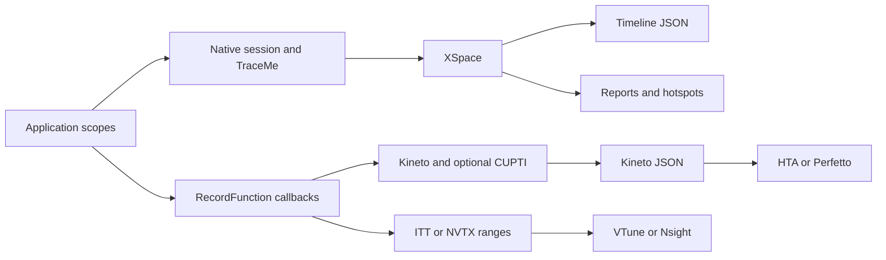

# Profiler user guide

Profiler is a standalone C++20 library for instrumenting application workloads.
It records scopes you annotate; it is not a sampling profiler and does not
automatically discover every function call.

[Documentation index](README.md) · [HTA guide](hta.md) · [Output examples](outputs.md)

## Contents

- [Choose a capture pipeline](#choose-a-capture-pipeline)
- [Build from source](#build-from-source)
- [Integrate with CMake](#integrate-with-cmake)
- [Install and find package](#install-and-find-package)
- [Build options](#build-options)
- [Native sessions](#native-sessions)
- [Threads and scope lifetime](#threads-and-scope-lifetime)
- [Reports and hotspots](#reports-and-hotspots)
- [Memory instrumentation](#memory-instrumentation)
- [Kineto capture](#kineto-capture)
- [ITT, NVTX, and GPU backends](#itt-nvtx-and-gpu-backends)
- [Architecture](#architecture)
- [Testing and troubleshooting](#testing-and-troubleshooting)
- [Code coverage](#code-coverage)
- [Sanitizers](#sanitizers)

## Choose a capture pipeline

Every supported build includes the native pipeline and one instrumentation
backend: Kineto or ITT. **Clients use one API.** `profiler::session` starts both
collectors. `PROFILER_SCOPE` / `PROFILER_FUNCTION` annotate both. The compiled
backend is not selected in application code.

| Pipeline | How the library uses it | Output |
| --- | --- | --- |
| Native | Always started with `session.start()` | Chrome Trace, reports, hotspots |
| Kineto | Compiled backend when `PROFILER_BACKEND=KINETO` | `write_trace()` JSON for Perfetto / HTA |
| ITT / NVTX | Compiled ITT backend, or `activity` + NVTX | Ranges for VTune / Nsight; `write_trace()` falls back to native Chrome Trace |

`write_trace()` prefers a Kineto file when that backend produced one; otherwise
it writes the native Chrome Trace. `write_chrome_trace()` always writes the
native timeline. Native and Kineto events are still stored separately inside
the library; the client does not merge them.

Native and Kineto can run alongside each other, but their events are not merged.
A native scope does not create a Kineto CPU correlation ID. A Kineto scope does
not appear in the native session report. Use Kineto for [HTA](hta.md).

## Build from source

Requirements: CMake 3.22 or newer, a compiler with C++20 support, C and C++
toolchains for dependencies, and Git. A first build may download GoogleTest and
missing dependency sources.

```bash
git clone --recurse-submodules https://github.com/KhwarizmiAnalytix/Profiler.git
cd Profiler
cmake -S . -B build -DCMAKE_BUILD_TYPE=Release \
  -DPROFILER_BACKEND=KINETO -DPROFILER_ENABLE_EXAMPLES=ON
cmake --build build --config Release --parallel
ctest --test-dir build -C Release --output-on-failure
```

For an existing checkout, run `git submodule update --init --recursive` first.
Use different build directories for different backends:

```bash
cmake -S . -B build-itt -DCMAKE_BUILD_TYPE=Release \
  -DPROFILER_BACKEND=ITT -DPROFILER_ENABLE_EXAMPLES=ON
cmake --build build-itt --config Release --parallel
ctest --test-dir build-itt -C Release --output-on-failure
```

On Windows, use an installed Visual Studio C++ toolchain. The same CMake commands
select a Visual Studio generator by default. `--config Release` selects the build
configuration; binaries are under `build/bin/Release/`. For Makefiles or Ninja,
`CMAKE_BUILD_TYPE=Release` selects the configuration and binaries are in `build/bin/`.

## Integrate with CMake

The [README](../README.md#add-it-to-your-project) contains a complete
FetchContent example. Set Profiler options before `FetchContent_MakeAvailable()`.
Pin the source revision for repeatable builds. The
[local FetchContent consumer](../consumer/fetchcontent/CMakeLists.txt) demonstrates
embedding this checkout without downloading another copy.

For a vendored checkout:

```cmake
set(PROFILER_ENABLE_TESTING OFF CACHE BOOL "" FORCE)
set(PROFILER_ENABLE_EXAMPLES OFF CACHE BOOL "" FORCE)
add_subdirectory(external/Profiler)
target_link_libraries(my_app PRIVATE Profiler::Profiler)
target_compile_features(my_app PRIVATE cxx_std_20)
```

Use the CMake target so the build's backend definitions and dependencies reach
consumers. Application code includes `profiler.h` only. Do not copy internal
include paths, include `native/` or `bespoke/` headers, or define
`PROFILER_HAS_*` manually.

## Install and find package

The installed package workflow uses a shared Profiler library:

```bash
cmake -S . -B build -DCMAKE_BUILD_TYPE=Release -DBUILD_SHARED_LIBS=ON
cmake --build build --config Release --parallel
cmake --install build --config Release --prefix "$PWD/install"
cmake -S consumer -B build-consumer -DCMAKE_PREFIX_PATH="$PWD/install"
cmake --build build-consumer --config Release --parallel
```

In a consumer project:

```cmake
find_package(Profiler CONFIG REQUIRED)
add_executable(my_app main.cpp)
target_compile_features(my_app PRIVATE cxx_std_20)
target_link_libraries(my_app PRIVATE Profiler::Profiler)
```

On Windows use an absolute prefix, for example
`-DCMAKE_PREFIX_PATH=C:/dev/Profiler/install`.

The installed package exports **`profiler.h`**. Use `profiler::session` for
native collection and the compiled Kineto or ITT backend together. Reports,
hotspots, memory tracking, and the lower-level `profiler::capture` type are
also available through that header. Kineto, ITT, and native implementation
headers are not part of the client API; link `Profiler::Profiler` and include
`profiler.h` only. See [consumer/main.cpp](../consumer/main.cpp).

The shared library must also be discoverable at runtime. On Windows, put the
installed `bin` directory on `PATH` or deploy `Profiler.dll` alongside the
executable. On Linux and macOS use an appropriate runtime search path; temporary
local checks can use `LD_LIBRARY_PATH` or `DYLD_LIBRARY_PATH`, respectively.
The CI consumer step demonstrates these settings.

### Installing a static build

`-DBUILD_SHARED_LIBS=OFF` also produces a `find_package`-consumable install
for the `PROFILER_BACKEND=KINETO` or `ITT` configuration with
`PROFILER_GPU_BACKEND=none`:

```bash
cmake -S . -B build-static -DCMAKE_BUILD_TYPE=Release -DBUILD_SHARED_LIBS=OFF
cmake --build build-static --config Release --parallel
cmake --install build-static --config Release --prefix "$PWD/install-static"
cmake -S consumer -B build-consumer-static -DCMAKE_PREFIX_PATH="$PWD/install-static"
cmake --build build-consumer-static --config Release --parallel
```

The consumer project's `find_package(Profiler CONFIG REQUIRED)` and
`target_link_libraries(... Profiler::Profiler)` lines are unchanged --
`Profiler::Profiler` carries its own required third-party static archives
(fmt, Kineto, and ITT's `ittnotify` when built with that backend) as link
dependencies, so nothing else needs to be added to the consumer's CMake.
Nothing extra needs to be on `PATH`/`LD_LIBRARY_PATH` either, since there's
no shared library to find at runtime.

A CUDA or HIP static build (`PROFILER_GPU_BACKEND=cuda`/`hip`) is not yet
`find_package`-consumable this way -- the consumer would also need
`find_dependency(CUDAToolkit)` wiring this package doesn't provide today.

## Build options

| Variable | Default | Meaning |
| --- | --- | --- |
| `PROFILER_BACKEND` | `KINETO` | Exactly one of `KINETO`, `ITT` |
| `PROFILER_GPU_BACKEND` | `none` | `none`, `cuda`, `hip` |
| `PROFILER_REQUIRE_CUDA` | `OFF` | Fail configuration when requested CUDA is unavailable |
| `PROFILER_REQUIRE_NVTX` | `OFF` | Fail CUDA configuration when NVTX is unavailable |
| `PROFILER_ENABLE_TESTING` | `ON` | Build `ProfilerCxxTests`; also register enabled example smoke tests |
| `PROFILER_ENABLE_EXAMPLES` | `OFF` | Build the examples |
| `PROFILER_ENABLE_INSTALL` | Standalone: `ON`; embedded: `OFF` | Install the library, headers, and CMake config |
| `PROFILER_ENABLE_LIBTORCH` | `OFF` | Optional LibTorch comparison tests when Torch is found |
| `PROFILER_CXX_STANDARD` | `20` | C++ language standard; current dependencies require C++20 |
| `PROFILER_THIRD_PARTY_DIR` | Repository submodules or downloads | Directory containing `fmt/`, `kineto/`, `ittapi/` |
| `PROFILER_ENABLE_COVERAGE` | `OFF` | Instrument `Profiler` with `--coverage` (GCC/Clang); see [code coverage](#code-coverage) |
| `PROFILER_SANITIZER` | unset | GCC/Clang sanitizer(s) for `Profiler` and `ProfilerCxxTests`; see [sanitizers](#sanitizers) |

A parent project's `MEMORY_GPU_BACKEND` supplies the default if
`PROFILER_GPU_BACKEND` is unset. The native pipeline is always compiled.
The HIP code path exists, but the main CI matrix does not exercise it.
Setting a GPU option alone is not proof that device activity capture is available;
check the configure summary and validate a trace on the target hardware.

## Native sessions

Prefer `profiler::session`. It starts the native collector together with the
compiled Kineto or ITT backend. `PROFILER_SCOPE` / `PROFILER_FUNCTION` /
`PROFILER_OP` annotate both. `PROFILER_PROFILE_SCOPE` and
`PROFILER_RECORD_USER_SCOPE` are aliases of `PROFILER_SCOPE`.

```cpp
#include "profiler.h"

int main() {
    profiler::session_options options;
    options.backend        = profiler::capture_backend::automatic;
    options.activities     = {profiler::activity::cpu};
    options.profile_memory = false;
    options.with_stack     = false;
    options.with_flops     = false;
    profiler::session session(options);
    if (!session.start()) return 1;
    {
        PROFILER_SCOPE("request");
        {
            PROFILER_SCOPE("decode");
            // Decode input.
        }
        {
            PROFILER_OP("execute");
            // Run computation.
        }
    }
    if (!session.stop()) return 1;
    return session.write_trace("request_trace.json") ? 0 : 1;
}
```

`write_trace()` writes Kineto JSON when that backend produced a file; otherwise
it writes the native Chrome Trace. `write_chrome_trace()` always writes the
native timeline. `PROFILER_FUNCTION()` uses the current function name.

`PROFILER_SCOPE` / `PROFILER_FUNCTION` / `PROFILER_OP` do not name a backend.
Collection is chosen on `session_options`:

| Option | Purpose |
| --- | --- |
| `backend` | `automatic` (the compiled `PROFILER_BACKEND`), or `kineto`, `itt`, `nvtx`, `kineto_gpu_fallback` |
| `activities` | Device activities to collect (`cpu`, `cuda`, `hip`) |
| `profile_memory` | Kineto allocator events via `report_memory_usage` |
| `with_stack` | Record C++ callsite stacks on instrumentation events |
| `with_flops` | Request flop metadata when the backend supports it |
| `report_input_shapes` | Record attached input-shape metadata |
| `with_modules` | Record module metadata when the backend supports it |
| `memory_tracking` | Native session memory tracker |
| `gpu_tracing` | Native GPU collector (not Kineto/CUPTI) |
| `native` / `instrumentation` | Start the native collector, the instrumentation backend, or both |

Default `backend` is `automatic`. An explicit backend that is not compiled in
causes `session.start()` to fail. `profiler::capture` uses the same flags on
`capture_config` when you want instrumentation without native collection.

The native-only builder remains for statistical analysis and output-format
options that are not on `session_options`:

```cpp
auto native = profiler::profiler_session_builder()
    .with_timing(true)
    .with_hierarchical_profiling(true)
    .with_memory_tracking(false)
    .with_statistical_analysis(true)
    .build();
```

An explicit `profiler::profiler_scope scope("name", native.get())` can target
that session. Capture a bounded workload and check the return values of
`start()`, `stop()`, and file writes. Only one native recording session may hold
the profiler lock at a time. Export after `stop()`; a subsequent capture
replaces the previous session's collected XSpace.

| Builder method | Purpose |
| --- | --- |
| `with_timing(bool)` | Enable timing |
| `with_hierarchical_profiling(bool)` | Enable hierarchy collection |
| `with_memory_tracking(bool)` | Enable the session memory tracker |
| `with_statistical_analysis(bool)` | Collect online statistical samples |
| `with_thread_safety(bool)` | Enable synchronized session operations |
| `with_gpu_tracing(bool)` | Enable the native GPU collector; backend support is required |
| `with_max_samples(size_t)` | Set the statistical sample limit |
| `with_percentiles(bool)` | Enable percentile calculations |
| `with_peak_memory_tracking(bool)` / `with_memory_deltas(bool)` | Configure memory statistics |
| `with_output_format(format)` / `with_output_file(path)` | Configure session report export |
| `build()` | Return a `std::unique_ptr<profiler_session>` |

Lower-level native tracing is implemented under `Profiler/native/tracing/` and
`Profiler/native/exporters/xplane/`. Those headers are library internals. Applications
use the session API from `profiler.h`.

## Threads and scope lifetime

Native scopes on worker threads use the active session. Join all workers and
finish every scope before stopping or destroying that session.

```cpp
#include <thread>
#include "profiler.h"

int main() {
    profiler::profiler_session session;
    if (!session.start()) return 1;
    std::thread worker([] {
        PROFILER_PROFILE_SCOPE("worker");
        // Work on this thread.
    });
    worker.join();
    if (!session.stop()) return 1;
    return session.write_chrome_trace("threads.json") ? 0 : 1;
}
```

A scope is a lifetime interval, so braces define its end. A scope still alive
when collection stops may be omitted. Keep the session alive while using reports
and hotspot objects derived from it. Join worker threads before shutdown even
when an application operation fails.

Kineto workers need explicit enrollment while the parent session is active:

```cpp
profiler::session session;
session.start();
std::thread worker([] {
    profiler::child_thread_capture enroll;
    PROFILER_SCOPE("worker");
    // Work inside the enrolled thread.
});
worker.join();
session.stop();
```

`profiler::child_thread_capture` enrolls on construction and removes the
worker on destruction. Pair enrollment and removal on the same worker.

## Reports and hotspots

Include `profiler.h`. Report and hotspot types are part of that public header.

```cpp
// After session.stop(), while session remains alive:
auto report = session.generate_report();
std::cout << report->generate_console_report();
bool ok = report->export_json_report("report.json") &&
          report->export_csv_report("report.csv") &&
          report->export_xml_report("report.xml");

auto hotspots = session.generate_hotspot_report();
std::cout << hotspots->table("self_cpu_time_total", 20);
std::cout << hotspots->top_down_tree();
std::cout << hotspots->bottom_up_hotspots(20);
```

`session.export_report(path)` uses the configured output format; the extension
does not select the format. `CONSOLE` and `FILE` emit text, `JSON` emits a session
report, `CSV` emits scope rows, and `STRUCTURED` emits XML. The explicit
`export_*_report()` methods make file-format intent clear and return success.

A session JSON report contains summaries and scope hierarchy. A timeline JSON
contains `traceEvents`. They are different schemas; do not send `report.json`
to a trace viewer or HTA. See [output examples](outputs.md) for every format.

Hotspots aggregate scopes with the same name. **CPU total** includes children;
**Self CPU** excludes nested child intervals. **CPU time avg** is total time
per call. Inclusive totals overlap, so adding parent and child totals counts
some time twice. Durations measure elapsed intervals, including waits and
instrumentation overhead, rather than CPU utilization or sampled instructions.

## Memory instrumentation

Native tracking and Kineto memory events are separate mechanisms. Enabling
memory tracking does not automatically instrument arbitrary `malloc`, `new`,
or every allocation inside a container.

For allocations you own, use the native session tracker while memory tracking
is enabled:

```cpp
void* ptr = std::malloc(1024);
if (ptr) {
    session.get_memory_tracker().track_allocation(ptr, 1024, "buffer");
    // Use the buffer.
    session.get_memory_tracker().track_deallocation(ptr);
    std::free(ptr);
}
```

For Kineto allocator events, set `config.profile_memory = true` before starting
the capture and report the allocator's actual accounting:

```cpp
profiler::report_memory_usage(
    ptr, allocated_bytes, total_allocated, total_reserved,
    static_cast<int16_t>(profiler::device_enum::CPU), -1);
```

`allocated_bytes` is signed: positive for allocation and negative for free.
Use `memory_profiling_active()` before expensive accounting. These reporting
hooks are inactive without a requesting instrumentation session. ITT/NVTX do
not turn these hooks into a native memory report. Zero tracked bytes does not
prove the process allocated no memory.

## Kineto capture

Build with `PROFILER_BACKEND=KINETO`. Use the same `profiler::session` and
`PROFILER_SCOPE` / `PROFILER_OP` as the native pipeline. Do not include Kineto
headers from application code. Select Kineto collection with `session_options`
(`backend`, `activities`, `profile_memory`, `with_stack`, `with_flops`, …).

```cpp
#include "profiler.h"

int main() {
    profiler::session_options options;
    options.backend    = profiler::capture_backend::kineto;
    options.activities = {profiler::activity::cpu};
    profiler::session session(options);
    if (!session.start()) return 1;
    {
        PROFILER_SCOPE("request");
        {
            PROFILER_OP("compute");
            // Application work.
        }
    }
    if (!session.stop()) return 1;
    return session.write_trace("kineto_trace.json") ? 0 : 1;
}
```

`profiler::capture` remains for backend-only captures (skip native collection).
`PROFILER_RECORD_USER_SCOPE` / `PROFILER_RECORD_FUNCTION` are aliases of
`PROFILER_SCOPE` / `PROFILER_OP`.

The function macro above produces a Kineto `cpu_op`; the user scope produces a
`user_annotation`. Both also record native scopes. `session.events()` exposes
recorded instrumentation events after `stop()`. Request CUDA device activities
with `session_options::activities = {profiler::activity::cpu, profiler::activity::cuda}`.
For arbitrary scalar metadata:

```cpp
PROFILER_RECORD_FUNCTION_WITH_METADATA(guard, "matrix_multiply");
profiler::record_function_metadata_builder(guard, "matrix_multiply")
    .with_metadata("rows", 256)
    .with_metadata("columns", 256);
```

The builder starts the guard after attaching metadata. Keep the guard alive
through the operation. This records application metadata, not automatic tensor
shapes or Python stack frames. C++ and Python language bindings to PyTorch are
not required. The [HTA guide](hta.md) extends this capture with iteration/rank
metadata and offline analysis. Attach rank metadata with
`profiler::add_metadata_json("distributedInfo", R"({"rank": 0, "world_size": 1})")`.

## ITT, NVTX, and GPU backends

**ITT:** Build with `PROFILER_BACKEND=ITT`. Use `profiler::session` and the same
annotation macros. Launch the application under Intel VTune to collect the
ranges. `write_trace()` falls back to native Chrome Trace because ITT does not
export a Kineto JSON file.

**NVTX:** In a CUDA/NVTX build, set `session_options.backend` (or
`capture_config.backend`) to `capture_backend::nvtx`.
Ranges become visible when running under NVIDIA Nsight. NVTX is a runtime
instrumentation state, not another value for `PROFILER_BACKEND`. Profiler uses
the NVTX C API, including the NVTX3 C header when selected by CMake.

ITT/NVTX `capture_result::save()` returns `false`. Use the external tool's
result or a separate native capture. For more background, see the
[NVTX documentation](https://nvidia.github.io/NVTX/).

**CUDA / CUPTI:**

```bash
cmake -S . -B build-cuda -DCMAKE_BUILD_TYPE=Release \
  -DPROFILER_BACKEND=KINETO -DPROFILER_GPU_BACKEND=cuda \
  -DPROFILER_REQUIRE_CUDA=ON -DPROFILER_REQUIRE_NVTX=ON \
  -DPROFILER_ENABLE_EXAMPLES=ON
cmake --build build-cuda --config Release --parallel
```

Use `-DCUDAToolkit_ROOT=/path/to/cuda` if discovery needs help. A toolkit is
sufficient to compile; a compatible NVIDIA GPU and driver are needed to collect
real device events. Request both `profiler::activity::cpu` and `profiler::activity::cuda`,
annotate the launching CPU operation with `PROFILER_RECORD_FUNCTION`, and
complete outstanding GPU work before stopping capture. See
[the HTA CUDA workflow](hta.md#capture-cuda-activities).

`KINETO_GPU_FALLBACK` provides event-based timings when available; it is not a
replacement for a full CUPTI trace with runtime-to-device correlation for HTA.
Native `with_gpu_tracing()` enables a separate GPU collector and does not enable
Kineto/CUPTI. The HIP path requires its platform libraries and is not
covered by the standard CI matrix or this guide's HTA validation.

## Architecture



| Directory | Responsibility |
| --- | --- |
| `Profiler/profiler.h` | Public client API (sessions, reports, capture, macros) |
| `Profiler/common/` | Shared types, public instrumentation, capture wrapper, platform utilities |
| `Profiler/native/session/` | Session lifecycle, scopes, reports, hierarchy reconstruction |
| `Profiler/native/tracing/`, `Profiler/native/cpu/` | TraceMe recording and host/thread-pool collection |
| `Profiler/native/gpu/` | Native GPU collection |
| `Profiler/native/exporters/` | XSpace model and timeline serialization |
| `Profiler/native/analysis/` | Statistics and native hotspots |
| `Profiler/bespoke/common/`, `Profiler/bespoke/base/` | RecordFunction orchestration and backend observers |
| `Profiler/bespoke/kineto/` | Kineto adapter (library-internal) |
| `Profiler/bespoke/itt/` | ITT adapter (library-internal) |

## Testing and troubleshooting

```bash
ctest --test-dir build -C Release --output-on-failure
./build/bin/ProfilerCxxTests --gtest_filter='PublicApi.*:BackendOutput.*'
```

The test suite exercises native exports, hierarchy, threads, hotspots, backend
instrumentation, metadata, and memory hooks. Hardware-dependent tests skip when
the required backend/device is unavailable. CI also builds an installed native
consumer for Kineto CPU configurations. Windows CUDA compilation does not prove
GPU runtime behavior on GitHub's hosted runners.

| Symptom | Check / action |
| --- | --- |
| Missing dependency files | Initialize recursive submodules; check `PROFILER_THIRD_PARTY_DIR` |
| Empty native trace | Check `start()`; use native scope macros; end scopes and join workers before `stop()` |
| Empty Kineto trace | Start `profiler::session` on a Kineto build; use `PROFILER_SCOPE` / `PROFILER_OP`; `stop()` before `write_trace()` |
| Missing worker events in Kineto | Enroll each child thread with `profiler::child_thread_capture` while the main capture is active |
| No GPU events | Check toolkit, driver/device, requested activities, and whether GPU work ran during collection |
| HTA parser errors | Use Kineto JSON; see [HTA troubleshooting](hta.md#troubleshooting) |
| No memory events | Enable memory tracking and supply allocation hooks for the selected pipeline |
| DLL / shared library not found | Set the runtime search path or deploy the library beside the executable |
| Windows duplicate `fmt::v12` symbols | Ensure Kineto and Profiler use the same compiled fmt target; reconfigure an old build tree |
| Missing `nvtx3/nvtx3.hpp` | Update to the C-header fix; Profiler uses `nvtx3/nvToolsExt.h` for its C API calls |

Profile optimized builds, warm up caches and runtime initialization before the
measurement window, and repeat captures. Name scopes consistently, measure
instrumentation overhead on the real workload, and compare like-for-like
hardware, compiler flags, inputs, and thread counts.

## Code coverage

`PROFILER_ENABLE_COVERAGE` instruments the `Profiler` library with `--coverage`
(GCC/Clang gcov-compatible). Use a Debug-like build type; optimizations skew
line/branch coverage.

```bash
cmake -S . -B build-coverage -DCMAKE_BUILD_TYPE=Debug \
  -DPROFILER_BACKEND=KINETO -DPROFILER_ENABLE_TESTING=ON \
  -DPROFILER_ENABLE_COVERAGE=ON
cmake --build build-coverage --parallel
ctest --test-dir build-coverage --output-on-failure

IGNORE=inconsistent,unsupported,format,count,unused,corrupt,empty
lcov --capture --directory build-coverage --output-file coverage.info \
  --ignore-errors "${IGNORE}"
lcov --extract coverage.info '*/Profiler/Profiler/*' \
  --output-file coverage.filtered.info --ignore-errors "${IGNORE}"
genhtml coverage.filtered.info --output-directory coverage-html \
  --ignore-errors "${IGNORE},category"
open coverage-html/index.html  # Linux: xdg-open
```

`--extract` keeps only first-party sources under `Profiler/`. Toolchain headers
(LLVM libc++, libstdc++, Apple SDK) and `third_party/` are omitted even when
gcov records them from inlined templates. `--ignore-errors` suppresses lcov's
function-end-line warnings from heavily templated/inlined code (a known lcov
limitation, harmless to line/function hit counts) — it does not hide real
coverage gaps. Only the `Profiler` target is instrumented, so the report
reflects library code, not the test suite itself.
CI runs this on Ubuntu with GCC and uploads the HTML report as a workflow
artifact; it is not gated on a coverage threshold.

## Sanitizers

`PROFILER_SANITIZER` builds `Profiler` and `ProfilerCxxTests` with GCC/Clang
sanitizer instrumentation. Not supported on MSVC.

```bash
cmake -S . -B build-asan -DCMAKE_BUILD_TYPE=RelWithDebInfo \
  -DPROFILER_BACKEND=KINETO -DPROFILER_ENABLE_TESTING=ON \
  -DPROFILER_SANITIZER=address,undefined
cmake --build build-asan --parallel
ASAN_OPTIONS=detect_leaks=0:halt_on_error=1 \
UBSAN_OPTIONS=halt_on_error=1:print_stacktrace=1 \
  ctest --test-dir build-asan --output-on-failure
```

Use `-DPROFILER_SANITIZER=thread` (a separate build directory; ThreadSanitizer
cannot combine with AddressSanitizer) for data-race detection across the
lock-free queue, thread-local storage, and RecordFunction callback paths.

`ASAN_OPTIONS=detect_leaks=0` is intentional on every platform: LeakSanitizer's
exit-time stop-the-world scan is not reliably supported on macOS and has been
observed to hang there indefinitely with no diagnostic output, after every
test already passed. CI therefore runs ASan+UBSan on Ubuntu and macOS with
leak detection off, and restricts ThreadSanitizer to Ubuntu only — TSan's
macOS support has independently shown toolchain-specific crashes during its
own runtime initialization (before any Profiler code executes), which Linux's
mature glibc/TSan integration does not exhibit.
