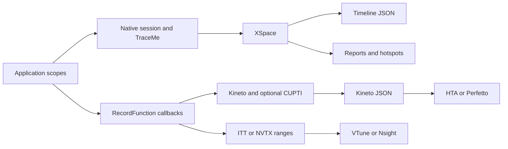

# Profiler user guide

Profiler is a standalone C++20 library for instrumenting application workloads.
It records scopes you annotate; it is not a sampling profiler and does not
automatically discover every function call.

[Documentation index](README.md) · [HTA guide](hta.md) · [Output examples](outputs.md)

## Contents

- [Choose a capture pipeline](#choose-a-capture-pipeline)
- [Build from source](#build-from-source)
- [Integrate with CMake](#integrate-with-cmake)
- [Install and find package](#install-and-find-package)
- [Build options](#build-options)
- [Native sessions](#native-sessions)
- [Threads and scope lifetime](#threads-and-scope-lifetime)
- [Reports and hotspots](#reports-and-hotspots)
- [Memory instrumentation](#memory-instrumentation)
- [Kineto capture](#kineto-capture)
- [ITT, NVTX, and GPU backends](#itt-nvtx-and-gpu-backends)
- [Architecture](#architecture)
- [Testing and troubleshooting](#testing-and-troubleshooting)

## Choose a capture pipeline

Every supported build includes the native pipeline and one instrumentation
backend: Kineto or ITT. Selecting `PROFILER_BACKEND=ITT` does not remove native
sessions or their reports.

| Pipeline | Instrumentation | Lifecycle | Output |
| --- | --- | --- | --- |
| Native | `PROFILER_PROFILE_SCOPE`, `PROFILER_PROFILE_FUNCTION`, TraceMe | `profiler_session::start()` / `stop()` | XSpace, timeline JSON, reports, native hotspots |
| Kineto | `PROFILER_RECORD_FUNCTION`, `PROFILER_RECORD_USER_SCOPE` | `prepareProfiler()`, `enableProfiler()`, `disableProfiler()` | `ProfilerResult`, Kineto JSON, event tree |
| ITT | `PROFILER_RECORD_*` | Enable `ProfilerState::ITT`, then disable | Ranges consumed by Intel VTune |
| NVTX | `PROFILER_RECORD_*` | Enable `ProfilerState::NVTX`, then disable | Ranges consumed by NVIDIA Nsight |

Native and Kineto can run alongside each other, but their events are not merged.
A native scope does not create a Kineto CPU correlation ID. A Kineto scope does
not appear in the native session report. Use Kineto for [HTA](hta.md).

## Build from source

Requirements: CMake 3.22 or newer, a compiler with C++20 support, C and C++
toolchains for dependencies, and Git. A first build may download GoogleTest and
missing dependency sources.

```bash
git clone --recurse-submodules https://github.com/KhwarizmiAnalytix/Profiler.git
cd Profiler
cmake -S . -B build -DCMAKE_BUILD_TYPE=Release \
  -DPROFILER_BACKEND=KINETO -DPROFILER_ENABLE_EXAMPLES=ON
cmake --build build --config Release --parallel
ctest --test-dir build -C Release --output-on-failure
```

For an existing checkout, run `git submodule update --init --recursive` first.
Use different build directories for different backends:

```bash
cmake -S . -B build-itt -DCMAKE_BUILD_TYPE=Release \
  -DPROFILER_BACKEND=ITT -DPROFILER_ENABLE_EXAMPLES=ON
cmake --build build-itt --config Release --parallel
ctest --test-dir build-itt -C Release --output-on-failure
```

On Windows, use an installed Visual Studio C++ toolchain. The same CMake commands
select a Visual Studio generator by default. `--config Release` selects the build
configuration; binaries are under `build/bin/Release/`. For Makefiles or Ninja,
`CMAKE_BUILD_TYPE=Release` selects the configuration and binaries are in `build/bin/`.

## Integrate with CMake

The [README](../README.md#add-profiler-to-your-application) contains a complete
FetchContent example. Set Profiler options before `FetchContent_MakeAvailable()`.
Pin the source revision for repeatable builds. The
[local FetchContent consumer](../consumer/fetchcontent/CMakeLists.txt) demonstrates
embedding this checkout without downloading another copy.

For a vendored checkout:

```cmake
set(PROFILER_ENABLE_TESTING OFF CACHE BOOL "" FORCE)
set(PROFILER_ENABLE_EXAMPLES OFF CACHE BOOL "" FORCE)
add_subdirectory(external/Profiler)
target_link_libraries(my_app PRIVATE Profiler::Profiler)
target_compile_features(my_app PRIVATE cxx_std_20)
```

Use the CMake target so the build's backend definitions and dependencies reach
consumers. Avoid copying internal include paths or defining `PROFILER_HAS_*`
manually. Compatibility target `XSigmaProfiler::Profiler` remains available;
new integrations should use `Profiler::Profiler`.

## Install and find package

The installed package workflow uses a shared Profiler library:

```bash
cmake -S . -B build -DCMAKE_BUILD_TYPE=Release -DBUILD_SHARED_LIBS=ON
cmake --build build --config Release --parallel
cmake --install build --config Release --prefix "$PWD/install"
cmake -S consumer -B build-consumer -DCMAKE_PREFIX_PATH="$PWD/install"
cmake --build build-consumer --config Release --parallel
```

In a consumer project:

```cmake
find_package(Profiler CONFIG REQUIRED)
add_executable(my_app main.cpp)
target_compile_features(my_app PRIVATE cxx_std_20)
target_link_libraries(my_app PRIVATE Profiler::Profiler)
```

`find_package(XSigmaProfiler CONFIG REQUIRED)` is a compatibility entry point.
On Windows use an absolute prefix, for example
`-DCMAKE_PREFIX_PATH=C:/dev/Profiler/install`.

The installed package supports the public native entry point used by
[consumer/main.cpp](../consumer/main.cpp). For backend-specific Kineto/ITT headers
and their transitive dependencies, use FetchContent or `add_subdirectory`.
The installed configuration does not currently export the full backend SDK.

The shared library must also be discoverable at runtime. On Windows, put the
installed `bin` directory on `PATH` or deploy `Profiler.dll` alongside the
executable. On Linux and macOS use an appropriate runtime search path; temporary
local checks can use `LD_LIBRARY_PATH` or `DYLD_LIBRARY_PATH`, respectively.
The CI consumer step demonstrates these settings.

## Build options

| Variable | Default | Meaning |
| --- | --- | --- |
| `PROFILER_BACKEND` | `KINETO` | Exactly one of `KINETO`, `ITT` |
| `PROFILER_GPU_BACKEND` | `none` | `none`, `cuda`, `hip`, `metal` |
| `PROFILER_REQUIRE_CUDA` | `OFF` | Fail configuration when requested CUDA is unavailable |
| `PROFILER_REQUIRE_NVTX` | `OFF` | Fail CUDA configuration when NVTX is unavailable |
| `PROFILER_ENABLE_TESTING` | `ON` | Build `ProfilerCxxTests`; also register enabled example smoke tests |
| `PROFILER_ENABLE_EXAMPLES` | `OFF` | Build the examples |
| `PROFILER_ENABLE_INSTALL` | Standalone: `ON`; embedded: `OFF` | Install the library, headers, and CMake config |
| `PROFILER_ENABLE_LIBTORCH` | `OFF` | Optional LibTorch comparison tests when Torch is found |
| `PROFILER_CXX_STANDARD` | `20` | C++ language standard; current dependencies require C++20 |
| `PROFILER_THIRD_PARTY_DIR` | Repository submodules or downloads | Directory containing `fmt/`, `kineto/`, `ittapi/` |

A parent project's `MEMORY_GPU_BACKEND` supplies the default if
`PROFILER_GPU_BACKEND` is unset. The native pipeline is always compiled.
HIP and Metal code paths exist, but the main CI matrix does not exercise them.
Setting a GPU option alone is not proof that device activity capture is available;
check the configure summary and validate a trace on the target hardware.

## Native sessions

```cpp
#include "profiler.h"

int main() {
    auto session = profiler::profiler_session_builder()
        .with_timing(true)
        .with_hierarchical_profiling(true)
        .with_memory_tracking(false)
        .with_statistical_analysis(true)
        .build();

    if (!session->start()) return 1;
    {
        PROFILER_PROFILE_SCOPE("request");
        {
            PROFILER_PROFILE_SCOPE("decode");
            // Decode input.
        }
        {
            PROFILER_PROFILE_SCOPE("execute");
            // Run computation.
        }
    }
    if (!session->stop()) return 1;
    return session->write_chrome_trace("request_trace.json") ? 0 : 1;
}
```

`PROFILER_PROFILE_FUNCTION()` uses the current function name. An explicit
`profiler::profiler_scope scope("name", session.get())` can target a session.
Capture a bounded workload and check the return values of `start()`, `stop()`,
and file writes. Only one native recording session may hold the profiler lock
at a time. Export after `stop()`; a subsequent capture replaces the previous
session's collected XSpace.

| Builder method | Purpose |
| --- | --- |
| `with_timing(bool)` | Enable timing |
| `with_hierarchical_profiling(bool)` | Enable hierarchy collection |
| `with_memory_tracking(bool)` | Enable the session memory tracker |
| `with_statistical_analysis(bool)` | Collect online statistical samples |
| `with_thread_safety(bool)` | Enable synchronized session operations |
| `with_gpu_tracing(bool)` | Enable the native GPU collector; backend support is required |
| `with_max_samples(size_t)` | Set the statistical sample limit |
| `with_percentiles(bool)` | Enable percentile calculations |
| `with_peak_memory_tracking(bool)` / `with_memory_deltas(bool)` | Configure memory statistics |
| `with_output_format(format)` / `with_output_file(path)` | Configure session report export |
| `build()` | Return a `std::unique_ptr<profiler_session>` |

Lower-level native tracing is available through `native/tracing/traceme.h`.
XSpace visitors and builders live under `native/exporters/xplane/`. Most
applications can use the session API without depending on these internals.

## Threads and scope lifetime

Native scopes on worker threads use the active session. Join all workers and
finish every scope before stopping or destroying that session.

```cpp
#include <thread>
#include "profiler.h"

int main() {
    profiler::profiler_session session;
    if (!session.start()) return 1;
    std::thread worker([] {
        PROFILER_PROFILE_SCOPE("worker");
        // Work on this thread.
    });
    worker.join();
    if (!session.stop()) return 1;
    return session.write_chrome_trace("threads.json") ? 0 : 1;
}
```

A scope is a lifetime interval, so braces define its end. A scope still alive
when collection stops may be omitted. Keep the session alive while using reports
and hotspot objects derived from it. Join worker threads before shutdown even
when an application operation fails.

Kineto workers need explicit enrollment while the parent capture is active:

```cpp
profiler::profiler_impl::enableProfilerInChildThread();
{
    PROFILER_RECORD_USER_SCOPE("worker");
    // Work inside the enrolled thread.
}
profiler::profiler_impl::disableProfilerInChildThread();
```

Pair enrollment and removal on the same worker and use a scope guard if its
workload can throw.

## Reports and hotspots

Include `native/session/profiler_report.h` when calling methods on the report
object. The umbrella header forward-declares that type.

```cpp
// After session.stop(), while session remains alive:
auto report = session.generate_report();
std::cout << report->generate_console_report();
bool ok = report->export_json_report("report.json") &&
          report->export_csv_report("report.csv") &&
          report->export_xml_report("report.xml");

auto hotspots = session.generate_hotspot_report();
std::cout << hotspots->table("self_cpu_time_total", 20);
std::cout << hotspots->top_down_tree();
std::cout << hotspots->bottom_up_hotspots(20);
```

`session.export_report(path)` uses the configured output format; the extension
does not select the format. `CONSOLE` and `FILE` emit text, `JSON` emits a session
report, `CSV` emits scope rows, and `STRUCTURED` emits XML. The explicit
`export_*_report()` methods make file-format intent clear and return success.

A session JSON report contains summaries and scope hierarchy. A timeline JSON
contains `traceEvents`. They are different schemas; do not send `report.json`
to a trace viewer or HTA. See [output examples](outputs.md) for every format.

Hotspots aggregate scopes with the same name. **CPU total** includes children;
**Self CPU** excludes nested child intervals. **CPU time avg** is total time
per call. Inclusive totals overlap, so adding parent and child totals counts
some time twice. Durations measure elapsed intervals, including waits and
instrumentation overhead, rather than CPU utilization or sampled instructions.

## Memory instrumentation

Native tracking and Kineto memory events are separate mechanisms. Enabling
memory tracking does not automatically instrument arbitrary `malloc`, `new`,
or every allocation inside a container.

For allocations you own, use the native session tracker while memory tracking
is enabled (`native/memory/memory_tracker.h`):

```cpp
void* ptr = std::malloc(1024);
if (ptr) {
    session.memory_tracker().track_allocation(ptr, 1024, "buffer");
    // Use the buffer.
    session.memory_tracker().track_deallocation(ptr);
    std::free(ptr);
}
```

For Kineto allocator events, set `config.profile_memory = true` before enabling
collection and report the allocator's actual accounting:

```cpp
profiler::report_memory_usage(
    ptr, allocated_bytes, total_allocated, total_reserved,
    static_cast<int16_t>(profiler::device_enum::CPU), -1);
```

`allocated_bytes` is signed: positive for allocation and negative for free.
Use `memory_profiling_active()` before expensive accounting. These reporting
hooks are inactive without a requesting instrumentation session. ITT/NVTX do
not turn these hooks into a native memory report. Zero tracked bytes does not
prove the process allocated no memory.

## Kineto capture

Build with `PROFILER_BACKEND=KINETO`. Use the backend API for CPU operators,
user annotations, event trees, and CUDA correlation:

```cpp
#include "profiler.h"
#include "bespoke/kineto/profiler_kineto.h"

int main() {
    using namespace profiler::profiler_impl;
    const ProfilerConfig config(ProfilerState::KINETO);
    const std::set<ActivityType> activities{ActivityType::CPU};
    prepareProfiler(config, activities);
    enableProfiler(config, activities);
    {
        PROFILER_RECORD_USER_SCOPE("request");
        {
            PROFILER_RECORD_FUNCTION("compute");
            // Application work.
        }
    }
    auto result = disableProfiler();
    return result && result->save("kineto_trace.json") ? 0 : 1;
}
```

The function macro above produces a `cpu_op`; the user scope produces a
`user_annotation`. `events()` exposes recorded events, `event_tree()` exposes
the hierarchy, and `save()` exports Kineto JSON. A trace should be saved once.
For arbitrary scalar metadata:

```cpp
PROFILER_RECORD_FUNCTION_WITH_METADATA(guard, "matrix_multiply");
profiler::record_function_metadata_builder(guard, "matrix_multiply")
    .with_metadata("rows", 256)
    .with_metadata("columns", 256);
```

The builder starts the guard after attaching metadata. Keep the guard alive
through the operation. This records application metadata, not automatic tensor
shapes or Python stack frames. C++ and Python language bindings to PyTorch are
not required. The [HTA guide](hta.md) extends this capture with iteration/rank
metadata and offline analysis.

## ITT, NVTX, and GPU backends

**ITT:** Build with `PROFILER_BACKEND=ITT`, enable `ProfilerState::ITT` through
the backend session API, and annotate with `PROFILER_RECORD_*`. Launch the
application under Intel VTune to collect the ranges. Native sessions remain
available for file exports.

**NVTX:** In a CUDA/NVTX build, enable `ProfilerState::NVTX`. Ranges become
visible when running under NVIDIA Nsight. NVTX is a runtime instrumentation
state, not another value for `PROFILER_BACKEND`. Profiler uses the NVTX C API,
including the NVTX3 C header when selected by CMake.

ITT/NVTX `disableProfiler()` returns a result without a Kineto trace;
`result->save()` returns `false`. Use the external tool's result or a separate
native capture. For more background, see the [NVTX documentation](https://nvidia.github.io/NVTX/).

**CUDA / CUPTI:**

```bash
cmake -S . -B build-cuda -DCMAKE_BUILD_TYPE=Release \
  -DPROFILER_BACKEND=KINETO -DPROFILER_GPU_BACKEND=cuda \
  -DPROFILER_REQUIRE_CUDA=ON -DPROFILER_REQUIRE_NVTX=ON \
  -DPROFILER_ENABLE_EXAMPLES=ON
cmake --build build-cuda --config Release --parallel
```

Use `-DCUDAToolkit_ROOT=/path/to/cuda` if discovery needs help. A toolkit is
sufficient to compile; a compatible NVIDIA GPU and driver are needed to collect
real device events. Request both `ActivityType::CPU` and `ActivityType::CUDA`,
annotate the launching CPU operation with `PROFILER_RECORD_FUNCTION`, and
complete outstanding GPU work before disabling capture. See
[the HTA CUDA workflow](hta.md#capture-cuda-activities).

`KINETO_GPU_FALLBACK` provides event-based timings when available; it is not a
replacement for a full CUPTI trace with runtime-to-device correlation for HTA.
Native `with_gpu_tracing()` enables a separate GPU collector and does not enable
Kineto/CUPTI. Metal and HIP paths require their platform libraries and are not
covered by the standard CI matrix or this guide's HTA validation.

## Architecture



| Directory | Responsibility |
| --- | --- |
| `common/` | Shared types, public instrumentation, platform utilities |
| `native/session/` | Session lifecycle, scopes, reports, hierarchy reconstruction |
| `native/tracing/`, `native/cpu/` | TraceMe recording and host/thread-pool collection |
| `native/gpu/` | Native GPU collection |
| `native/exporters/` | XSpace model and timeline serialization |
| `native/analysis/` | Statistics and native hotspots |
| `bespoke/common/`, `bespoke/base/` | RecordFunction orchestration and backend observers |
| `bespoke/kineto/` | Kineto adapter, result/event APIs, export |

## Testing and troubleshooting

```bash
ctest --test-dir build -C Release --output-on-failure
./build/bin/ProfilerCxxTests --gtest_filter='PublicApi.*:BackendOutput.*'
```

The test suite exercises native exports, hierarchy, threads, hotspots, backend
instrumentation, metadata, and memory hooks. Hardware-dependent tests skip when
the required backend/device is unavailable. CI also builds an installed native
consumer for Kineto CPU configurations. Windows CUDA compilation does not prove
GPU runtime behavior on GitHub's hosted runners.

| Symptom | Check / action |
| --- | --- |
| Missing dependency files | Initialize recursive submodules; check `PROFILER_THIRD_PARTY_DIR` |
| Empty native trace | Check `start()`; use native scope macros; end scopes and join workers before `stop()` |
| Empty Kineto trace | Prepare/enable Kineto; use `PROFILER_RECORD_*`; disable before saving |
| Missing worker events in Kineto | Enroll each child thread while the main capture is active |
| No GPU events | Check toolkit, driver/device, requested activities, and whether GPU work ran during collection |
| HTA parser errors | Use Kineto JSON; see [HTA troubleshooting](hta.md#troubleshooting) |
| No memory events | Enable memory tracking and supply allocation hooks for the selected pipeline |
| DLL / shared library not found | Set the runtime search path or deploy the library beside the executable |
| Windows duplicate `fmt::v12` symbols | Ensure Kineto and Profiler use the same compiled fmt target; reconfigure an old build tree |
| Missing `nvtx3/nvtx3.hpp` | Update to the C-header fix; Profiler uses `nvtx3/nvToolsExt.h` for its C API calls |

Profile optimized builds, warm up caches and runtime initialization before the
measurement window, and repeat captures. Name scopes consistently, measure
instrumentation overhead on the real workload, and compare like-for-like
hardware, compiler flags, inputs, and thread counts.
